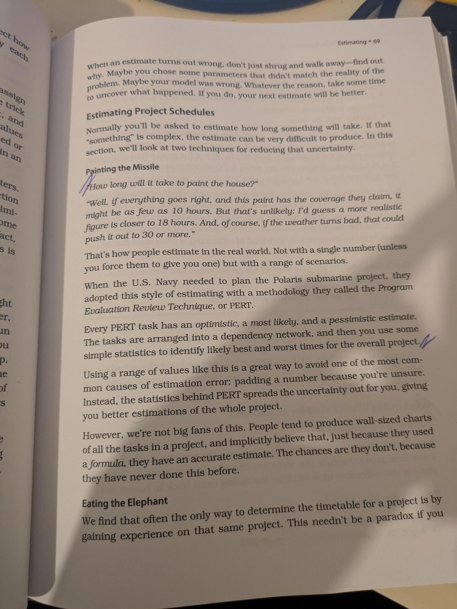

# Orthogonality

It is a concept if we want to produce systems that are easy to design,build, test and extend.
In computing, the term has come to signify a kind of independence or decoupling. Two or more things are orthogonal if changes in one do not affect any of the others. 
In a well-designed system, the db system will be orthogonal to the user interface: you can
change the interface without affecting the db and vice-versa.

## Benefits of Orthogonality
Non-orthogonal systems are inherently more complex to change and control. When components of
any system are highly interdependent, there is no such thing as a local fix. 

We want to design components that are self-contained: independent, and with a single, well-defined purpose.
When components are isolated from one another, you know that you can change one without having to worry
about the rest. As long as you don’t change that component’s external interfaces, you can be comfortable that you won’t cause problems that
ripple through the entire system.

You get two major benefits if you write orthogonal systems: 

1. Gain Productivity
- Simple components can be designed, coded, unit tested, and then forgotten—there is no need
  to keep changing existing code as you add new code.
- An orthogonal approach also promotes reuse. The more loosely coupled your systems, the easier
  they are to reconfigure and reengineer.

2. Reduce Risk
- Diseased sections of code are isolated. If a module is sick, it is less likely to spread the symptoms around the rest of the system.
- The resulting system is less fragile. Make small changes and fixes to a particular area, and any problems you generate will be restricted to that area.

## Coding
Every time you write code you run the risk of reducing the orthogonality of your application. Unless you constantly monitor not just what you
are doing but also the larger context of the application, you might unintentionally duplicate functionality in some other module, or express
existing knowledge twice. 

There are several techniques you can use to maintain orthogonality:

1. Keep the code decoupled -----> Write SHY code - modules that dont reveal anything unnecessary to other modules and that dont rely on other modules implementations.
If you need to change an object state, get the object to do it for you. This way your code remains isolated from the other code’s implementation and increases the chances that you’ll remain orthogonal.
### Shy Code
- Hide internal details (Encapsulation)
- Avoids knowing how others work internally
- Asks other objects to do things, rather than reaching inside and doing it for them.

### Example:

```csharp
class BankAccount 
{        
    public decimal Balance; // This class just exposes its internal data
}

class BankService 
{
    public void Withdraw(BankAccount account, decimal amount) 
    {
        account.Balance -= amount; // Directly accessing and mutating internal state
    }
}
```

The above is not orthogonal:
1. The service knows how to manipulate the class internal state
2. If the balance rules changes, you will need to fix it in the service as well. Also, they're tightly coupled — not orthogonal.

We certainly could have make changes in the service. But what if there is another service and in that case, if the business logic changes for `Balance`,
you will need to haunt down every place where it is used. 

The below demonstrates the good practice:

```csharp
class BankAccount 
{
    private decimal _balance;
    public BankAccount(decimal initialBalance)
    {
        _balance = initialBalance;
    }
    
    public bool Withdraw(decimal amount) {
        if (amount <= 0 || amount > _balance) {
            return false;
        }

        _balance -= amount;
        return true;
    }
    
    public decimal GetBalance() => _balance;
}


class BankService {
    public void ProcessWithdrawal(BankAccount account, decimal amount) {
        if (!account.Withdraw(amount)) {
            Console.WriteLine("Withdrawal failed: insufficient funds.");
        } else {
            Console.WriteLine("Withdrawal successful.");
        }
    }
}
```

2. Avoid Global Data ---> Global state is the enemy of modular, independent code. They create hidden dependencies:

- Your module looks independent.

- But it actually relies on some external state that's shared (and possibly mutable).

- That shared state makes it hard to test, hard to reason about, and dangerous in multithreaded environments.


## Testing

An orthogonally designed and implemented system is easier to test. Because the interactions between the system’s components are formalized and limited, more of the system testing can be performed at the
individual module level. This is good news, because module level (or unit) testing is considerably easier to specify and perform than integration testing. In fact, we suggest that every module have its own unit
test built into its code, and that these tests be performed automatically as part of the regular build process.

Building unit tests is itself an interesting test of orthogonality. What does it take to build and link a unit test? Do you have to drag in a large
percentage of the rest of the system just to get a test to compile or link? If so, you’ve found a module that is not well decoupled from the rest of
the system.

### Bug Fixing
Bug fixing is also a good time to assess the orthogonality of the system as a whole. When you come across a problem, assess how localized
the fix is. Do you change just one module, or are the changes scattered throughout the entire system? When you make a change, does it
fix everything, or do other problems mysteriously arise?  If you use a source code control system, tag bug fixes when you check the code back in after testing. You can
then run monthly reports analyzing trends in the number of source files affected by each bug fix.

### Step-Step Guidelines on how to run monthly reports
#### STEP 1: Use meaningful commit messages for bug fixes

`git commit -m "BUG-1234 - Taufique's commit"
`
#### STEP 2: Tag the commit with the bug ID and PUSH

`git tag BUG-1234`

`git push origin BUG-1234`

If you use GitKraken, see how you can add Tag: https://help.gitkraken.com/gitkraken-desktop/tags/#:~:text=Adding%20tags,the%20tag%20to%20the%20remote.

#### STEP 3: If you prefer to analyze how many files were affected per bug fix

`git diff --stat BUG-1234^ BUG-1234`

GitKraken does a wonderful job here showing which files are affected in nice interface

#### STEP 4: Git log filters for bug tracking

`git log --grep="BUG-" --oneline` 

OR

`git log --grep="BUG-"`

OR With dates

`git log --grep="BUG-" --pretty=format:"%h %ad | %s" --date=short`

OR with Graph

`git log --grep="BUG-" --oneline --graph --decorate --date=short --pretty=format:"%h %ad %s"`

## Domain Language

Computer languages influence how you think about a problem, and how you think about communicating. Every language comes with a
list of features—buzzwords such as static versus dynamic typing, early versus late binding, inheritance models (single, multiple, or none)—all
of which may suggest or obscure certain solutions. Designing a solution with Lisp in mind will produce different results than a solution based
on C-style thinking, and vice versa. Conversely, and we think more importantly, the language of the problem domain may also suggest a
programming solution.

## Estimating

One of the interesting things about estimating is that the units you use make a difference in the interpretation of the result. If you say
that something will take about 130 working days, then people will be expecting it to come in pretty close. However, if you say “Oh, about
six months,” then they know to look for it any time between five and seven months from now. Both numbers represent the same duration,
but “130 days” probably implies a higher degree of accuracy than you feel. We recommend that you scale time estimates as follows:

### 🕒 Duration Quote Estimates

| Duration          | Interpretation                              |
|-------------------|----------------------------------------------|
| **1–15 days**     | Days                                          |
| **3–8 weeks**     | Weeks                                         |
| **8–30 weeks**    | Months                                        |
| **30+ weeks**     | Think hard before giving an estimate 🧠       |

So, if after doing all the necessary work, you decide that a project will take 125 working days (25 weeks), you might want to deliver an estimate of “about six months.”
The same concepts apply to estimates of any quantity: choose the units of your answer to reflect the accuracy you intend to convey.

### Understand What’s Being Asked
The first part of any estimation exercise is building an understanding of what’s being asked. As well as the accuracy issues discussed above,
you need to have a grasp of the scope of the domain. Often this is implicit in the question, but you need to make it a habit to think about
the scope before starting to guess. Often, the scope you choose will form part of the answer you give: “Assuming there are no traffic accidents
and there’s gas in the car, I should be there in 20 minutes.



### What to Say When Asked for an Estimate
You say “I’ll get back to you.”
You almost always get better results if you slow the process down and
spend some time going through the steps we describe in this section.
Estimates given at the coffee machine will (like the coffee) come back to
haunt you.