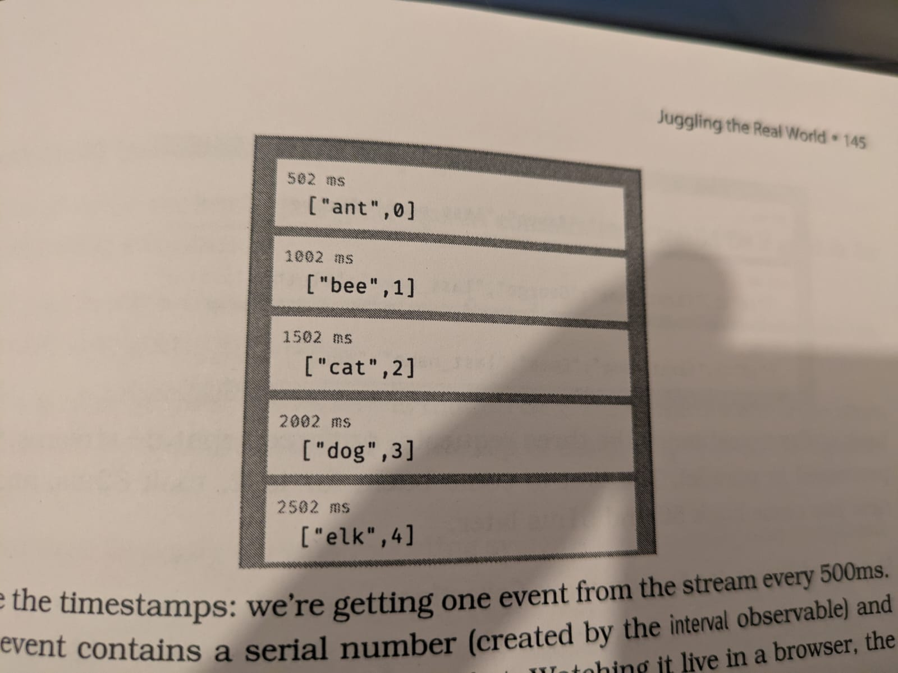

# Bend Or Break

## Decoupling
When you are designing a software that you will want to change, you want exactly the opposite. You want it to be flexible. And to be flexible, individual components should be coupled to as few other components as possible. 
What does it mean to decouple code? 
Coupling can happen any time two pieces of code share something. Also keep in my the following:

1. Wacky dependencies between unrelated modules or libraries.
2. Simple changes to one module that propagate through unrelated modules in the system or break stuff elsewhere in the system.
3. Developers who are afraid to change because they arent sure what might be affected.


1. Train wrecks - chains of method calls
2. Globalization - the danger of static things
</br > The reuse probably not be a primary concern when creating code. but the thinking that goes into the making code reusable should be part of your coding routine.  
Avoid Global Data. If it is important to be Global, Wrap it in an API
3. Inheritance - why subclassing is dangerous

## Juggling the Real World

### Events
An event represents the availability of information. It might come from the outside world: a user clicking a button, or a stock quote update. It might be internal: the result of a calculation is ready, a search finishes. It can be sth as trivial as fetching the next element in a list.
Whatever the source, if we write applications that responds to events, and adjust what they do based on those events, those applications will work better in the real world.
But how we write these kinds of applications. There are four strategies:

1. Finite State Machine: 
This is not applicable for Hardware but for software as well. Read Page from 138 to 141.
</br >
</br >
2. The Observer Pattern:
[Observer Pattern.md](Observer%20Pattern.md)
</br >
</br >
3. Publish/Subscribe
   </br > In simple terms, Imagine you’re interested in weather updates:
- You subscribe to a weather app. 
- That app doesn’t know who you are or how many people are subscribed.
- When the weather changes, it publishes a notification (like “It’s going to rain”). 
- Everyone who subscribed to weather updates gets notified.

The app does not care who gets the message. You don’t care where the message came from — you’re decoupled. That’s the Pub/Sub pattern.
It is more like saying I don’t want to hard-code who needs this info. I’ll just announce it — and whoever cares can listen.

4. Reactive Programming and Streams.

If you have ever used a spreadsheet, then you will be familiar with reactive programming. If a cell contains a formula which refers to a second cell, then updating the second cell causes the first to update as well.
The value react as the values they use change. There are many frameworks that can help with this kind of data-level reactivity:
in the realm of the browser React and Vue.js are the current favorites.

It's clear that events can also be used to trigger reactions in code, but it isn't
necessarily easy to plumb them in. That's where streams come in.

Streams let us treat events as if they were a collection of data. It's as if we had a list of events, which got longer when new events arrive. The beauty of that is that we can treat streams just like any other collection: we can manipulate, combine, filter, and do all the other data-ish things we know so well. We can even combine event streams and regular collections. And streams can be asynchronous, which means your code gets the opportunity to respond to events as they arrive.

Our first example takes two streams and zips them together: the result is a new stream where each element contains one item from the first input stream and one item from the other. In this case, the first stream is simply a list of five animal names. The second stream is more interesting: it's an interval timer which generates an event every 500ms. Because the streams are zipped together, a result is only generated when data is available on both, and so our result stream only emits a value every half second:

```javascript
import * as Observable from 'rxjs'
import { logValues } from "../rxcommon/logger.js"
let animals = Observable.of("ant", "bee", "cat", "dog", "elk")
let ticker = Observable.interval(500)
let combined = Observable.zip (animals, ticker)
combined.subscribe (next => logValues (JSON.stringify(next)))
```

Results

Notice the timestamp: we are getting one event from the steam every 500ms.

## Transforming Programming
[Transforming Programming.md](Transforming%20Programming.md)

## Inheritance Tax

